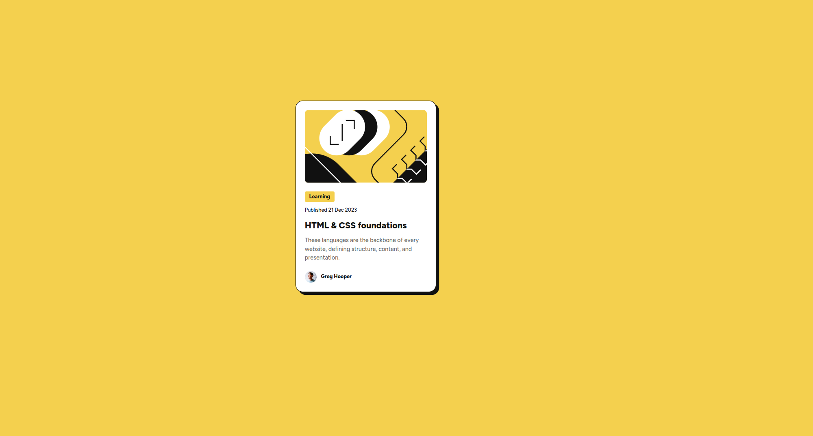

# Frontend Mentor - Blog preview card solution

This is a solution to the [Blog preview card challenge on Frontend Mentor](https://www.frontendmentor.io/challenges/blog-preview-card-ckPaj01IcS). Frontend Mentor challenges help you improve your coding skills by building realistic projects. 

### Screenshot

### Links

- Solution URL: [github](https://github.com/mostafa-hsh/Blog-preview-card)
- Live Site URL: [github pages](https://mostafa-hsh.github.io/Blog-preview-card/)

## My process

### Built with
- Flexbox

### What I learned

I learned more about flex and it properties in this challenges, and it was a lot of fun.

Frontend Mentor - [@mostafa-hsh](https://www.frontendmentor.io/profile/mostafa-hsh)
thanks FRONTEND-MENTOR